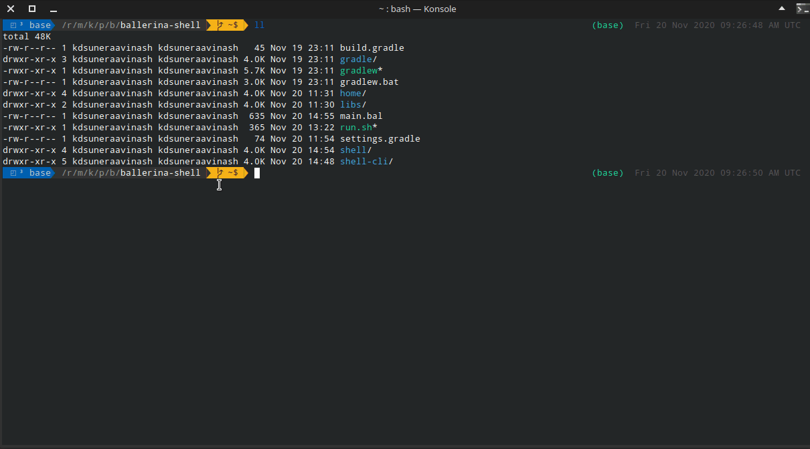

# Ballerina Shell

A REPL program for the [ballerina language](https://github.com/ballerina-platform/ballerina-lang).  Ballerina is an open source programming language and platform for  cloud-era application programmers to easily write software that just works.

The Ballerina-shell tool is an interactive tool for learning the Ballerina programming language and prototyping Ballerina code. Ballerina-shell is a Read-Evaluate-Print Loop (REPL), which evaluates declarations, statements, and expressions as they are entered and immediately shows the results. Currently, the tool is run via the command line. Using Ballerina-shell, you can enter program statements one at a time and immediately see the result.

## Demo



## Modules

The project is implemented in two base modules.

- **shell** - Module including all the base evaluation classes. This has all the base components to evaluate and run a string. All other components are built on top of this module. You may find the source code for this module [here](shell).
- **shell-cli** - A command-line interface built on top of shell. Includes multi-line inputs, color-coded outputs, keyword-based auto-completion, etc... You may find the source code for this module [here](shell-cli).

## Known Issues

- **The parser is imperfect** - Current parser is imperfect and is sometimes unable to detect the type of statement. Please file an issue if you come across any wrong categorization of a snippet. The parser is also relatively slow compared to the compilation phase, acting as a bottle-neck. So a timeout is employed to stop invalid statement parsing from taking too much time. However, this might cause issues in some old hardware where the execution might be slower than expected (where even valid executions might exceed the timeout).

- **Assignments to global variables in closures or class methods will not work** - Assignments done to global variables in closures will not be reflected after the execution. The changes will be visible only for the scope belonging to the snippet where the closure was defined. However the value of the global variables inside a closure will reflect the current real value of the said variable.


## Implementation

For implementation details please refer [this](shell/README.md).

## Building

> **Linux** - Simply clone the repository and run `run.sh`. It should launch the REPL.

Run following commands in order.

```batch
gradlew.bat fatJar
java -jar shell-cli/build/libs/shell-cli-1.0-SNAPSHOT.jar
```

##  References

[reple: "Replay-Based" REPLs for Compiled Languages](https://people.eecs.berkeley.edu/~brock/blog/reple.php) - A blog post on reple: "Replay-Based" REPLs for Compiled Languages and limitations/fixes possible.

[RCRL](https://github.com/onqtam/rcrl) - Read-Compile-Run-Loop: tiny and powerful interactive C++ compiler (REPL)

[JShell](https://docs.oracle.com/javase/9/jshell/introduction-jshell.htm#JSHEL-GUID-630F27C8-1195-4989-9F6B-2C51D46F52C8) - A REPL for Java programming language.

