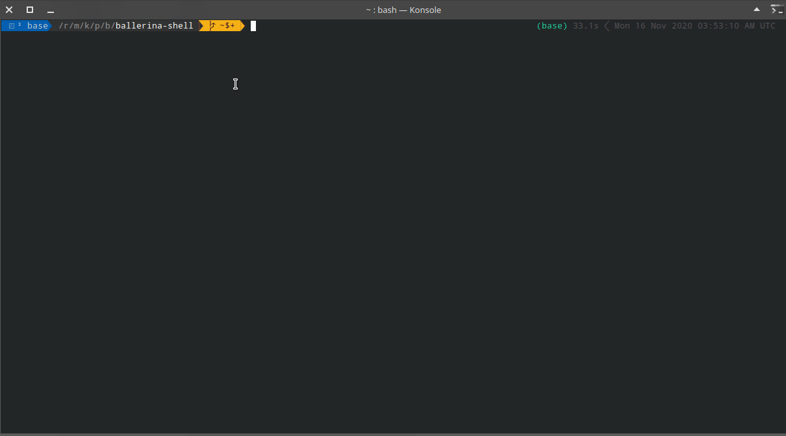

# Ballerina Shell

A REPL program for the [ballerina language](https://github.com/ballerina-platform/ballerina-lang).  Ballerina is an open source programming language and platform for  cloud-era application programmers to easily write software that just works.

The Ballerina-shell tool is an interactive tool for learning the Ballerina programming language and prototyping Ballerina code. Ballerina-shell is a Read-Evaluate-Print Loop (REPL), which evaluates declarations, statements, and expressions as they are entered and immediately shows the results. Currently, the tool is run via the command line. Using Ballerina-shell, you can enter program statements one at a time and immediately see the result.

## Demo



## Current Approach

Current approach with the ballerina-shell is a Replay-Based approach.  With this approach, each time the user enters a line of code, a file is generated containing the snippet and the whole program is compiled and executed again/replayed, and any new output is printed. 

Following is the template for the code generation. Once the program is run, any compiler errors/warnings are displayed to the user. A print guard is used so that the user will not see previous print statements. 

```ballerina
import ballerina/io;

// Import statements
<#list imports as import>
    ${import}
</#list>

// Module/Variable declarations
<#list moduleDclns + varDclns as topDcln>
    ${topDcln}
</#list>

# Old statements will be added here.
# Since old statements are checked, no error should be returned.
function old_statements() {
    <#list stmts as stmt>
        <#if stmt.expr>
            reserved = ${stmt.code}; // Expressions as valid statements
        <#elseif stmt.stmt>
            ${stmt.code} // Statements as is
        </#if>
    </#list>
}

# New statements will be added here.
# These might be invalid/runtime error statements.
# + return Error if any old statement caused an error.
function new_statement() returns error? {
    <#if lastStmt.stmt>
        ${lastStmt.code}
    </#if>
}

// Reserved declarations.
any|error reserved = ();
type NoExpression record {};
type NoExpressionError error<NoExpression>;

# Main run function.
# Will execute new statements and expressions.
# If there is a runtime error in any expressions/statements,
# an error would be returned.
# Otherwise a string representation of the expression will be returned.
# If last statement is not an expression, `NoExpressionError` is thrown.
# + return String representation if OK, otherwise the error.
function run() returns string|error {
    check  new_statement();
    any|error expr =  <#if lastStmt.expr> ${lastStmt.code} <#else> NoExpressionError("No expression") </#if>;
    any value = checkpanic expr;
    string output = io:sprintf("%s", value);
    return output;
}

# Main function entry point.
# To filter old print statements, a filter guard is set.
public function main() {
    old_statements();

    io:println();
    io:println("${ioActivationStart}"); // Begin IO guard

    string|error result = trap run();
    if (result is string) {
        // Output expression evaluation
        io:println(result);
    } else if (result is NoExpressionError) {
        // Ignore if no expression given
    }else {
        // Output colored error message if runtime error thrown
        var color_start = "\u{001b}[33;1m";
        var color_end = "\u{001b}[0m";
        io:println(color_start, "Exception occurred: ", result.message(), color_end);
    }

    io:println("${ioActivationEnd}"); // End IO guard
}

# Useless function to pretend to use imports so the
# compiler won't complain.
# This will accept imports with `Error` exported.
# Most of the standard modules export `Error`.
# TODO: Remove this temp fix.
function garbage_function() {
    <#list importPrefixes as importPrefix>
        reserved = ${importPrefix}:Error;
    </#list>
}
```

## Limitations

Obvious limitation is the **interpretation performance**. Because of this approach, the compilation has to be done in every step. This is significantly slow and affects the user experience. Even if this approach is used by some other projects as well, because of the current efficiency of the ballerina compiler, any statement evaluation takes a considerable amount of time.

Another limitation is **randomness**, because of the replaying approach, any statement that involves randomness will result in different evaluation each time. This will also include any statement that interacts with the external environment such as network calls, user inputs, etc... This can be mitigated by persisting global variable values at the end of the execution. However, since some of the types do not support serialization, this issue can only be mitigated via serializing any value that supports and de-serializing  at the next execution startup just before the evaluation of the new statement.

Another limitation is **re-evaluation** of performance heavy snippets. For an example, a loop containing a significant amount of iteration will cause the execution to be extremely slow because it needs to be evaluated at the each execution. To fix this we can use the serializing approach together with removing any statements of which the state afterwards is correctly preserved. So if the statement did not change the program state (values of global variables) or the changes were correctly persisted, we can remove these statements.

Other limitations include, race conditions involving parallel execution, service declarations not being supported, etc...

## Possible approaches

Other than this, there are few other approaches possible that are used by other similar projects.

> TODO: Add possible approaches

## References

[reple: "Replay-Based" REPLs for Compiled Languages](https://people.eecs.berkeley.edu/~brock/blog/reple.php) - A blog post on reple: "Replay-Based" REPLs for Compiled Languages and limitations/fixes possible.

[JShell](https://docs.oracle.com/javase/9/jshell/introduction-jshell.htm#JSHEL-GUID-630F27C8-1195-4989-9F6B-2C51D46F52C8) - A REPL for Java programming language.

