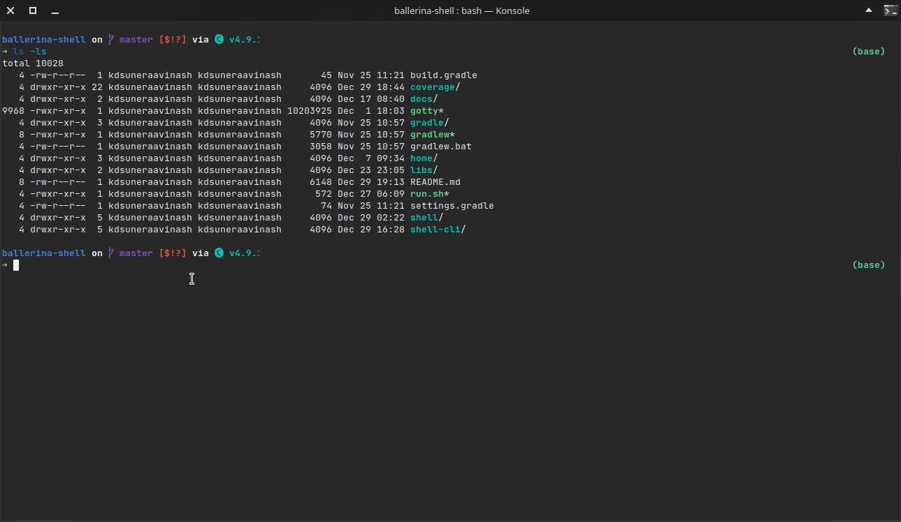

# Ballerina Shell

A REPL program for the [ballerina language](https://github.com/ballerina-platform/ballerina-lang). Ballerina is an open
source programming language and platform for cloud-era application programmers to easily write software that just works.

The Ballerina-shell tool is an interactive tool for learning the Ballerina programming language and prototyping
Ballerina code. Ballerina-shell is a Read-Evaluate-Print Loop (REPL), which evaluates declarations, statements, and
expressions as they are entered and immediately shows the results. Currently, the tool is run via the command line.
Using Ballerina-shell, you can enter program statements one at a time and immediately see the result.

## Demo



## Modules

The project is implemented in two base modules.

- **shell** - Module including all the base evaluation classes. This has all the base components to evaluate and run a
  string. All other components are built on top of this module. You may find the source code for this
  module [here](shell).
- **shell-cli** - A command-line interface built on top of shell. Includes multi-line inputs, color-coded outputs,
  keyword-based auto-completion, etc... You may find the source code for this module [here](shell-cli).

## Known Issues

- **Assignments to global variables in closures or class methods will not work** - Assignments done to global variables
  in closures will not be reflected after the execution. The changes will be visible only for the scope belonging to the
  snippet where the closure was defined.

  ```ballerina
  int x = 10
  var f = function () { x = 12; }
  f()
  x   // <- this should output 12 but will output 10 instead
  ```

- **Enum definition with explicit expression is not supported** - Enum declarations with explicit expressions are not
  supported. This is due to how the enum expressions are implemented using constants.

  ```ballerina
  // This will not work
  enum Language {EN="engish", TA="tamil", SI="sinhala"}
  ```

- **Module level declarations of types should not be quoted** - Quoted identifiers must not be used for type
  declarations. The declaration would work, but the quote would be ignored when defining something using the type.

  ```ballerina
  // Do not define even though an error will not be given in this stage
  type 'Person_\{name\&Ȧɢέ\} record {| string 'first\ name; int 'Ȧɢέ; |}; 
  // This will not work.
  'Person_\{name\&Ȧɢέ\} person = {'first\ name: "Tom", 'Ȧɢέ:25}
  ```

### Notes

- **The parser is imperfect** - Current parser is imperfect and is sometimes unable to detect the type of statement.
  Please file an issue if you come across any wrong categorization of a snippet. The parser is also relatively slow
  compared to the compilation phase, acting as a bottle-neck. So a timeout is employed to stop invalid statement parsing
  from taking too much time. However, this might cause issues in some old hardware where the execution might be slower
  than expected (where even valid executions might exceed the timeout).

- **Type guards for global variables do not work** - Since all the variables defined in REPL top level act as global
  variables, type guards won't work. To remedy this you can explicitly cast the variable to the required type. However,
  note that this is the expected behavior and not a bug. This will be fixed once the language supports global type
  guards.

- **Using var with types that are not visible to the public** - When using var, if a exported type that is not visible
  to the REPL is used, REPL will try to use any/error combination that will not cause an error. A warning will be also
  given.

## Implementation

For implementation details please refer [this](shell/README.md).

## Building

> **Linux** - Simply clone the repository and run `run.sh`. It should launch the REPL.

Run following commands in order.

```batch
gradlew.bat fatJar
java -jar -Dballerina.home=home -Djava.util.logging.manager="org.ballerinalang.logging.BLogManager" shell-cli/build/libs/shell-cli-1.0-SNAPSHOT.jar
```

**To run with an installed ballerina distribution,** (This will enable stdlib imports)
In the following script, `$BALLERINA_HOME` refers to the ballerina distribution directory. Ballerina shell is compatible
with `ballerina-slp7` or higher.

```bash
java -jar -Djava.util.logging.manager="org.ballerinalang.logging.BLogManager" -Dballerina.home=$BALLERINA_HOME shell-cli/build/libs/shell-cli-1.0-SNAPSHOT.jar
# eg: java -jar -Djava.util.logging.manager="org.ballerinalang.logging.BLogManager" -Dballerina.home=/usr/lib/ballerina/distributions/ballerina-slp7 shell-cli/build/libs/shell-cli-1.0-SNAPSHOT.jar
```

## References

[reple: "Replay-Based" REPLs for Compiled Languages](https://people.eecs.berkeley.edu/~brock/blog/reple.php) - A blog
post on reple: "Replay-Based" REPLs for Compiled Languages and limitations/fixes possible.

[RCRL](https://github.com/onqtam/rcrl) - Read-Compile-Run-Loop: tiny and powerful interactive C++ compiler (REPL)

[JShell](https://docs.oracle.com/javase/9/jshell/introduction-jshell.htm#JSHEL-GUID-630F27C8-1195-4989-9F6B-2C51D46F52C8)

- A REPL for Java programming language.

