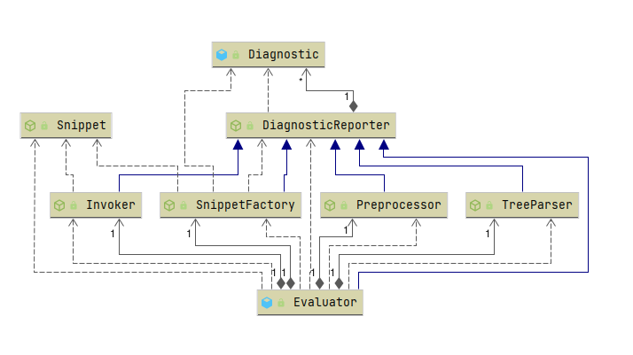
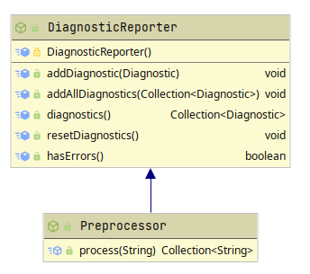
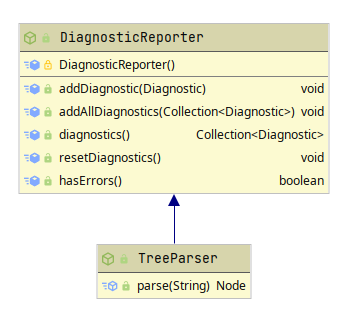
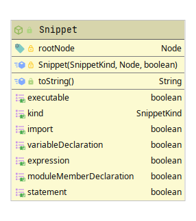
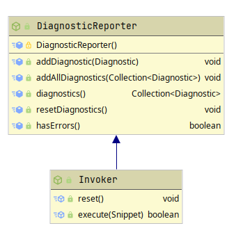

# Ballerina Shell Design Document

## Evaluator




## Preprocessor

The preprocessor is the first transformational phase of the program. Any input is sent through the preprocessor to convert the input into a list of individually processable statements. For example, any multiple statement input will be split into the relevant list of string counterpart at the end of this phase. The implemented `SeparatorPreprocessor` currently splits the statements into separated lists depending on the semicolons that are in the root bracket level. The motivation of a preprocessor is to divide the input into separately identifiable sections so each can be individually processed.



Currently, following preprocessors are implemented.

| Preprocessor Name      | Description                                                  |
| ---------------------- | ------------------------------------------------------------ |
| Separator preprocessor | Preprocessor to split the input into several statements based on the semicolons and brackets. |

Following are some inputs and expected output of the preprocessor for reference.

| Input                                             | Expected Output                                     |
| ------------------------------------------------- | --------------------------------------------------- |
| `int number`                                      | [`int number`]                                      |
| `int number; number = 100;`                       | [`int number;`, `number = 100;`]                    |
| `function () { int p = 100; string h = "hello";}` | [`function () { int p = 100; string h = "hello";}`] |
| `int a = 0; while (a < 10) { a+= 1; }`            | [`int a = 0;`, `while (a < 10) { a+= 1; }`]         |

## Tree Parser

In this stage, the correct syntax tree is identified. The root node of the syntax tree must be the corresponding type for the statement. For example, for an import declaration, the tree that is parsed should have `ImportDeclarationNode` as the root node.



Currently, following tree parsers are implemented.

| Tree Parser Name  | Description                                                  |
| ----------------- | ------------------------------------------------------------ |
| Trial Tree Parser | Parses the source code line using a trial based method. The source code is placed in several places and is attempted to parse. This continues until the correct type can be determined. |

> TODO: Find a way to create a tree parser that directly uses ballerina parser without depending on trials.

Following are some inputs and expected output of the tree parser for reference.

| Input                       | Expected Output Root Node       |
| --------------------------- | ------------------------------- |
| `import ballerina/io;`      | `ImportDeclarationNode`         |
| `int variable = 100;`       | `ModuleVariableDeclarationNode` |
| `while (a) { int i = 100;}` | `WhileStatementNode`            |

## Snippet Factory

Snippets are individual statements.

Every snippet must have a **kind** (which dictates where the snippet should go). Each snippet must refer to a single statement. That means if the same input line contained several statements, it would be parsed into several snippets. (This separation is done in the preprocessor.)

In processing the snippets, if a snippet contained an error and failed to run, the execution of the snippet would be stopped. If the snippet was contained in a line with more snippets, (if the input contained multiple snippets) all the snippets would be ditched. This also means that an error snippet is taken as if it were never given. 

Also, names given to the REPL may never be overridden. (If x variable is defined, you cannot redefine variable x even with the same type. The same goes for functions, classes, etc..) However, any valid redeclaration in a different scope may be possible.

### Snippet Base Type

Snippets are defined in terms of the source code it contains.



Snippets would be of mainly 5 categories. Erroneous snippets are rejected as soon as they are detected. So, there isn't a category for them.

#### Import Snippet

Snippets that represent an import statement. 

> Add support for imports.

##### Limitations

- Because of using Project API, home directory do not support imports other than `io`.
- Due to limitations in the compiler, practically no imports can be done even if the above issue is fixed. According to the language specification one cannot have unused imports which results in import snippets always causing an error. As a result no other imports than the ones that are already there cannot be used.

#### Variable Declaration Snippet

The bulk of the handling is done for these types of snippets since these snippets hold the whole REPL state. (as global variables) 

In the REPL, only module-level variables are allowed. The main motivation of that is to keep a global state. (So every defined variable is available to others.) Thus, `VariableDeclarationNodes` will also be converted into `ModuleVariableDeclarationNode`. However, the ability of variable declarations to not have an initializer will be an issue. Currently, the declaration will be converted as is. If there isn't a initializer, compiler will give an error.

> TODO: Inject filler values.

##### Infer a filler value if possible (TODO)

Because every declaration is a module-level declaration, it must have an initializer. However, for usability, some variables should have a default value to initialize if the initializer is not given. For example, an integer can be initialized with a 0 if an initializer is not provided. However, this will only be done for a selected few types where a default initializer is trivial.

Following initializers will be used when an initializer is not provided. Note that, because of lack of information at the stage of this operations, it is not possible to infer the default types of the types which are defined by the user. This will also include var, which is a type determined by the compiler. The table also includes whether the type is serializable.

| Type                                                         | Filler Default Value                          |
| ------------------------------------------------------------ | --------------------------------------------- |
| `()`                                                         | `()`                                          |
| `boolean`                                                    | `false`                                       |
| `int`, `float`, `double`, `byte`                             | `0`                                           |
| `string`                                                     | `""`                                          |
| `xml`                                                        | `xml '<!---->'`                               |
| `array`, `tuple`                                             | `[]`                                          |
| `map`                                                        | `{}`                                          |
| `record`                                                     | `{}`                                          |
| `table`                                                      | `table []`                                    |
| `any`                                                        | `()`                                          |
| `union`                                                      | any available filler value of types in union. |
| `optional`                                                   | `()`                                          |
| `json`, `anydata`                                            | `()`                                          |
| `intersection`, `singleton`, `readonly`, `never`, `distinct` | None                                          |
| all behavioral types                                         | None                                          |
| all other types                                              | None                                          |

*Default values for xml, array, tuple, map, record have the potential to fail or cause errors. However, they are still used if the user didn't provide one in the expectation that the user will identify the error if the default value failed. [Ballerina Default Fill Members](https://ballerina.io/spec/lang/2020R1/#FillMember)

Following are some inputs and expected filler values for reference.

| Input                     | Expected Type | Expected Filler Value(s) |
| ------------------------- | ------------- | ------------------------ |
| `int number;`             | `int`         | `0`                      |
| `error|int|string value;` | `union`       | `0` or `""`              |
| `var t`                   | `other`       | None                     |

#### Module Member Declaration Snippet

Module-level declarations. These are not active or runnable. Service declaration can start a service on a port, etc... All other declarations are just declarations. They do not execute to return a value. Also, any undefined variable in these declarations is ignored. These do not contain semicolons at the end. 

##### Sub Kinds

| Sub Kind Name                    | State    | Notes                                                        |
| -------------------------------- | -------- | ------------------------------------------------------------ |
| Function Definition              | OK       |                                                              |
| Listener Declaration             | OK       | There must be a initializer. However, there may be undefined variables inside the initializer. |
| Type Definition                  | OK       |                                                              |
| Service Declaration              | REJECTED | Has a side effect of starting a server.                      |
| Constant Declaration             | OK       | Constant variables are always defined in the module level.   |
| Module Variable Declaration      | MOVED    | Moved responsibility into Variable Declaration Kind.         |
| Annotation Declaration           | OK       | ?                                                            |
| Module XML Namespace Declaration | OK       |                                                              |
| Enum Declaration                 | OK       |                                                              |
| Class Definition                 | OK       |                                                              |

##### Examples

```C#
function printValue(string value) { } // Function Definition
listener http:Listener helloWorldEP = new (9095, helloWorldEPConfig); // Listener Declaration
type newType record{string name;}; // Type Definition
service hello on new http:Listener(9090) { } // Service Declaration 
const int var1 = 3; // Constant Declaration
// TODO: No examples // Annotation Declaration
xmlns "http://ballerina.com/aa" as ns0; // Module XML Namespace Declaration
enum Color { RED, GREEN, BLUE } // Enum Declaration
class Person { } // Class Definition
```

#### Statement Kind

These are normal statements that should be evaluated from top to bottom inside a function. Fail Statement Sub Kind is not accepted. 

##### Sub Kinds

| Sub Kind Name                       | State | Notes                                                        |
| ----------------------------------- | ----- | ------------------------------------------------------------ |
| Assignment Statement                | OK    |                                                              |
| Compound Assignment Statement       | OK    |                                                              |
| Variable Declaration Statement      | MOVED | Moved responsibility into Variable Declaration Kind.         |
| Block Statement                     | OK    |                                                              |
| Break Statement                     | ERROR | Break cannot be used outside of a loop.                      |
| Fail Statement                      | ERROR | Fail statements must appear inside a function. (Similar to return) |
| Expression Statement                | MOVED | Moved responsibility into Expression Kind.                   |
| Continue Statement                  | ERROR | Continue cannot be used outside of a loop.                   |
| If Else Statement                   | OK    |                                                              |
| While Statement                     | OK    |                                                              |
| Panic Statement                     | OK    | Similar to throwing an error. Will throw the error and ignore from then. |
| Return Statement                    | ERROR | Return cannot exist outside of a function.                   |
| Local Type Definition Statement     | MOVED | Moved responsibility into Module Member Declaration Kind.    |
| Lock Statement                      | OK    | Atomically change the values of the variables.               |
| Fork Statement                      | OK    | Starts workers. (Might cause problems)                       |
| For Each Statement                  | OK    |                                                              |
| XML Namespace Declaration Statement | MOVED | Moved responsibility into Module Member Declaration Kind.    |
| Transaction Statement               | OK    |                                                              |
| Rollback Statement                  | ERROR | Rollback cannot be used outside of a transaction block.      |
| Retry Statement                     | OK    | Retry can exist outside transactions as a general purpose control. |
| Match Statement                     | OK    | Similar to switch statements.                                |
| Do Statement                        | OK    | ?                                                            |

##### Examples

```C#
var1 = 3; // Assignment Statement
var1 += 3; // Compound Assignment Statement
{ int var1 =4; } // Block Statement
if (cond) { } // If Else Statement
while (cond) { } // While Statement
panic error("Record is nil"); // Panic
lock { amount += n; } // Lock
fork { } // Fork
foreach var color in colors { } // For Each Statement
transaction { } // Transaction Statement
retry<Type> (args) { } // Retry Statement
match var1 { 0 => {} 1 => { } } // Match Statement
// TODO: No examples // Do Statement
```

#### Expression Kind

> TODO: Should expressions and statements be merged into one type?

These are expressions that are executable but are not persistent. (Does not affect other statements/expressions) These do not contain semicolons. (If the expression is an Expression Statement or a statement with a semicolon, the semicolon will be stripped.)

##### Examples

```C#
var1 == var2 // Binary Expression
(var1 == var2) // Braced Expression
check func1(10) // Check Expression
abc.value // Field Access Expression
func1(arg1) // Function Call Expression
abs.method(arg1)// Method Call Expression
{ line: "str", country: "abc" } // Mapping Constructor Expression
typeof var1 // Typeof Expression
! var1 // Unary Expression 
object { public string city; } // Object constructor Expression
var1 is Type // Type Test Expression [ISSUE]
abc->method(arg1) // Action
() // Nil Literal
4 // Basic Literal
int|string // Type Descriptor [ISSUE] : Abstract so cant detect
trap func1(10) // Trap Expression
[1, 2, 3, 4] // List Constructor Expression
<float> v1 // Type Cast Expression
table [ {id: 1, name: "J"}, {id: 2, name: "B"} ] // Table Constructor Expression [ISSUE]
let int x = 2 in x*2 // Let Expression
string `INSERT INTO Details VALUES (${p.name}, ${p.age})` // Template Expression
function(int arg1) { } // Annonymous Function Expression
new Abc(arg1) // New Expression
from var student in studentList select { name: student.firstName }   // Query Expression
start func1(arg1) // Start Action
flush worker1 // Flush Action [ISSUE]
// TODO: No examples // Annot Access Expression
abc?.value // Optional Field Access Expression
cond ? func1() : func2() // Conditionl Expression
transactional // Transactional Expression
@http:WebSocketServiceConfig {} service {} // Service Constructor Expression ((DECIDE))
base16 `112233` // Byte Array Expression
bookXML/**/<fname> // XML Navigate Expression
```

#### Others

Any other snippet is considered to be invalid/syntax errors.

### Limitations

- Some variable names, function names are reserved by the snippet. (eg: `_reserved`) And functions declared by the REPL must not be used as it may cause stack overflows. (This is a huge problem since `main` method name is known always)
- Some statements or expressions cannot be supported. (eg: statements involving thread) Since current implementation in each run, such statements would return a different value each time. Also table constructor expressions are disabled because table constructor cannot be assigned to `any`.

## Invoker

Invoker will make sure of executing the snippet. This is where the bulk of execution logic lies. Invoker will use a `Context` to generate a file and execute it. (The logic may change depending on the invoker used)



### Replay Invoker

This is the currently implemented invoker. It will populate the following template and execute it via `Project API`.

```java
<#-- @ftlvariable name="" type="io.ballerina.shell.invoker.replay.ReplayContext" -->
import ballerina/io as _io;
<#list imports as import>
    ${import}
</#list>

<#list varDclns + moduleDclns as dcln>
    ${dcln}
</#list>

function statements() {
    any|error _reserved = ();
    <#list stmts as stmt>
        <#if stmt.second>
           ${stmt.first}
        <#else>
           _reserved = ${stmt.first};
        </#if>
    </#list>
}

any|error _reserved = ();

public function main() {
    statements();

    any|error expr = ();
    <#if lastExpr.second>
       ${lastExpr.first}
    <#else>
       expr = trap ${lastExpr.first};
    </#if>

    if (expr is ()){
    } else if (expr is error){
        var color_start = "\u{001b}[33;1m";
        var color_end = "\u{001b}[0m";
        _io:println(color_start, "Exception occurred: ", expr.message(), color_end);
    } else {
        _io:println(expr);
    }
}
```

### Implementation II - Replay improved (TODO)

> TODO: Fix bug of state preservation if a statement changed state.

In this implementation every statement is reevaluated. However because of the issues that this might pose, (randomness/computation heavy snippets) some small optimizations are done.

- A subset of global variables are serialized. A dump file in json format is used for this. The template would generate the code required to convert these variables. (Not all variable types are serializable)
- If a later statement or expression did not change the state, that statement or expression would be ditched. In the reevaluation that snippet is not evaluated at all.
- If a later statement or expression changes only the serialized state, the state change would be recorded and the statement would be ditched.
- If a later statement or expression changed non-serialized state, that statement would be persisted.
